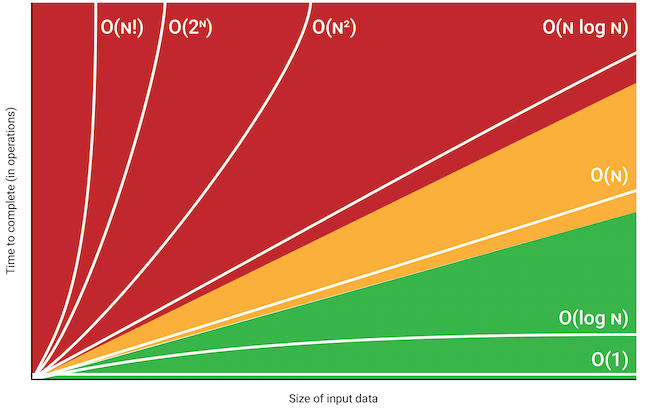

## Big O Notation
Big O notation is a way to describe the efficiency of an algorithm. It provides a mathematical notation that represents the limiting behavior of a function as the input size tends towards infinity.

It takes the worst case scenario to define a time complexity for an algorithm.



---
$O(1)$: Constant time complexity. It means that the time taken by the algorithm to execute is independent of the input size.
Ex: Accessing an item in a Python dictionary
```python
dictionary = {"name":"John","age":35}
print(dictionary["name"])
```
---
$O(log n)$: Logarithmic time complexity. It means that the time taken by the algorithm increases logarithmically with the input size.
Examples:
* [Binary Search](./binarySearch/binarySearch.md)
---
$O(n)$: Linear time complexity. It means that the time taken by the 
algorithm increases linearly with the input size.

---
$O(n * log n)$: Linearithmic time complexity. It means that the time taken by the algorithm increases in a way that is somewhere between linear and logarithmic.

---
$O(n^2)$: Quadratic time complexity. It means that the time taken by the algorithm increases quadratically with the input size.

---
O(2^n): Exponential time complexity. It means that the time taken by the algorithm increases exponentially with the input size.

---
$O(n!)$: Factorial time complexity. It means that the time taken by the algorithm increases by the factorial of the input size.

---
These are just a few examples of Big O notation. It is used to analyze and compare the efficiency of different algorithms in terms of their time complexity.